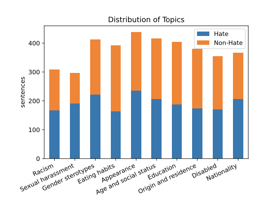
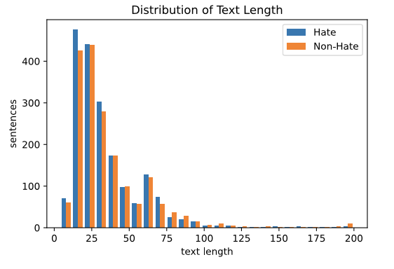
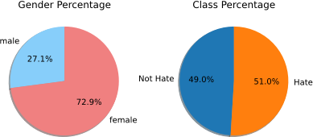

# APEACH - Korean Hate Speech Evaluation Datasets

We provide the first crowd-generated Korean evaluation dataset for hate speech detection.

The sentences of our dataset are created by unspecified workers, moderated by a crowd-sourcing platform [DeepNatural AI](https://www.deepnatural.ai/).

## Download

- APEACH2021 : You can download benchmark set **APEACH2021**.  `APEACH2021/test.csv`  in this repository.

## Dataset Description

- APEACH2021

### Guidelines

[APEACH-GUIDELINE](https://docs.google.com/document/d/1XqJ5E-OXK3ULX9WCbc10Bj0k9vTfJqQ6E7D2QHP9DWU/edit?usp=drivesdk)

### Topics

### Lengths

### Demographics

## Experiment Results

| Name               | Beep! Dev Dataset | Apeach-2021 (Ours) |
| ------------------ | ----------------- | ------------------ |
| SoongsilBERT-Base | 0.8261 | **0.8424** |
| SoongsilBERT-Small | 0.8149            | 0.8228 |
| KcBERT-base        | 0.8088 | 0.8086 |
| KcBERT-large       | **0.8295** | 0.8116 |
| DistillKoBERT | 0.7570 | 0.7715 |
| KoELECTRA-V3       | 0.7920 | 0.8101 |
| KoBERT             | 0.8030 | 0.7885 |

We also share SOTA model of our dataset which we trained in this experiment as checkpoint, [demo webite](https://master-soongsil-bert-base-beep-deploy-jason9693.endpoint.ainize.ai) and [api](https://github.com/jason9693/SoongsilBERT-base-beep-deploy).

## Contributors

The main contributors of the work (* : equal contribution) : 

- Kichang Yang* ([Kakao Enterprise](https://www.kakaoenterprise.com/), [Soongsil University](https://eng.ssu.ac.kr))**
- Wonjun Jang* ([Soongsil University](https://eng.ssu.ac.kr))**
- Won Ik Cho* ([Seoul National University](https://en.snu.ac.kr/index.html))**

## License

 

This work is licensed under a [Creative Commons Attribution-ShareAlike 4.0 International License](http://creativecommons.org/licenses/by-sa/4.0/).

## Reference